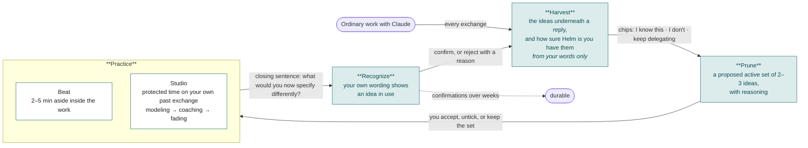

# Helm — design rationale

*Claude does the work. You keep the understanding.*

Prototype: https://educationlabstakehome.vercel.app · Code: https://github.com/aguydane/education_labs_takehome · The walkthrough opens on first visit and can be restarted from the header, as either seeded person.

## 1. The problem

I chose Option B because it names a need I feel in my own work. Before AI assistance, learning was integrated with engineering: I went deep on principles because the problem required it, and I couldn't build what I didn't understand. That rigor is what I lose now unless I'm intentional. The work still gets done, faster than ever; the understanding no longer has to come along.

The question is how to keep developing mastery inside an accelerated loop with an AI assistant, without slowing down and without refusing to delegate. What my own understanding buys me is **steering capacity**: more precise intentions, a sharper eye for whether an output is going where I meant, the range to cross into adjacent territory. Understanding deep enough to specify, judge, and redirect.

Two requirements follow, and they became the product's two halves: stepping back to learn has to feel legitimate inside a working day (Beat and Studio), and the product has to show you that learning is already happening through the act of doing (Harvest and Recognize).

## 2. What I built

Helm is a web app (Next.js on Vercel, Claude API on the server) that runs a four-step loop alongside ordinary work with Claude, seeded with two people: Maya, a backend engineer, and Eli, a maritime defense associate, each with three weeks of history. Onboarding is a scripted walkthrough on the real app.

*Claude observes and proposes at every arrow; the learner judges at every arrow.*

*[Figure: the map, with the legend.]*

**Harvest.** After every exchange, a background call identifies the ideas a person would need to have produced it and estimates, from the learner's own words only, how confident we can be that they have each one. It never interrupts; the result is chips under the reply, each with "I know this," "I don't," and "keep delegating."

**Prune.** Claude proposes a small active set of ideas to practice, with reasoning; the learner decides, on a map of everything their work has surfaced. Slots turn over on graduation or the learner's say-so, never because something newer arrived.

**Practice.** *Beat* is a two-to-five-minute aside inside the work, offered when the learner asks why or when a piece of work wraps up. *Studio* is calendar-blocked, state-saved time on one idea, on the learner's own past exchange, at a rung the learner controls: modeling, coaching, or fading. It starts on schedule or in the wait after the learner kicks off long-running agent work.

**Recognize.** When the learner's own prompts or critiques show an idea in use, Claude proposes a recognition, quoting the words and saying why they count. The learner confirms or rejects with a reason; confirmations spread over weeks make an idea durable.

The map doubles as a journal: notes on ideas and edges, Claude's speculation on why two ideas keep meeting, and a history of Studio sessions that can be reopened.

**A day with it.** Maya asks why Claude chose full jitter for a retry backoff, takes the beat it offers, and answers a question about when jitter matters. She kicks off an hour-long backfill and spends the wait in Studio on her own migration from last week. Back at work she writes a retry policy precisely enough that Helm recognizes the idea in her words and asks whether that was really her. Nothing in the day was a lesson.

**How it's built.** Pure pipeline functions over a transcript store behind a storage interface, seven Claude routes, three panels. The seeded histories were not written by hand: synthetic transcripts were replayed through the real pipeline. A Playwright suite walks the loop with the routes mocked; every build was also verified live.

## 3. Who it's for

Helm is for people who already use Claude for real work, and it doesn't care what the work is. The concept space isn't a taxonomy; it's harvested from the learner's exchanges and named the way a practitioner would name it. The same prompts, with no domain configuration, produced *composite index design* for an engineer and *the McCorpen defense* for an associate; Eli exists as the generalization test. Skill level is handled per idea, not per user: harvest estimates confidence from wording, the learner overrides it, the rung moves, and "keep delegating" clears what an expert doesn't need. What doesn't generalize yet is the social part: teams and cohorts would need the map to be shareable.

## 4. Design decisions and trade-offs

**Harvest reads only the learner's words, checked mechanically.** Knowledge shows in how people phrase constraints and corrections; the assistant's reply is not evidence about them. A quote not found in the learner's message is discarded with its confidence estimate. Paraphrased evidence is lost too; that's the right side to err on.

**"Keep delegating" is a first-class answer.** Most ideas aren't worth understanding, and a tool that implies otherwise becomes a source of guilt. Delegated ideas stay on the map, dimmed, and never trigger offers.

**The active set is small and sticky.** Three ideas held for weeks; Prune proposes at most one swap, only when a challenger clearly dominates. Interests followed week to week never settle. The curiosity pin, which protects one idea from the ranking, is the release valve.

**The map is the primary surface.** Pruning happens on it and recognitions light it up; it stayed, despite being the riskiest build item, because it makes the loop visible.

**Two practice modes.** Integrated practice supplies raw experience; set-aside practice lets you name and extend the abstractions in it. Neither holds without the other. The names, Beat and Studio, are deliberately a little corny: a mode switch has to lower the productivity pressure the moment it appears, and a name that makes you smile does that fastest.

**The long-task wait is the first trigger.** When I kick off long-running work I fill the wait with another task or a distraction. An offer to go deeper on the very thing the agent is doing costs nothing at that moment and is the most situated material available. Below it: the learner's own why-questions, natural pause points, the scheduled block. Nothing fires mid-flow, and every dismissal is remembered.

**Studio runs on a rung and closes with one sentence.** Modeling, coaching, and fading are an explicit fading schedule the learner moves at will. The closing question, "what would you now specify differently in a prompt about this kind of work?", is the product's definition of success, and that sentence is what Recognize later looks for.

**Recognize proposes; rejections are routed.** A recognition is information, not a reward. "I copied a pattern" is the strongest signal that an idea needs practice; "I already knew this" corrects the model; "that's not the idea" fixes the rubric.

**The journal feeds the prompts**: notes are read by Studio and weighed by Prune, so writing down what you think changes what Claude does with you. **Onboarding is the product**: a static "how it works" page became a walkthrough that advances only when the real thing happens. **What was cut:** time tracking became one "learning budget" number, a scheduler became a calendar strip, a memory system became JSON behind an interface, and product integration was deferred.

## 5. Agency

The rule throughout is *Claude observes and proposes; you judge.* Claude coined the phrase during the design conversation; I kept it because it matched what I believed: a model processes language at a speed and capacity I can't, and what I can do is judge whether a proposal matches my experience and my motivations. It's real in specific places: Harvest hides nothing and puts a correction beside every estimate; Prune changes nothing until accepted; Recognize asks, and a "no" is information; the rung, the closing sentence, and the notes are the learner's. It's weaker elsewhere: Helm decides what counts as an idea and how to name it; trigger moments are the product's; a recognition confirmed out of politeness teaches the wrong thing; and the system is a dyad.

## 6. Learning principles

One tension shaped the product more than any other: learning integrated with the work versus learning set aside from it, with self-determination theory across both, since the learner has to be the one choosing when to step out. Helm interleaves them. Studio is set-aside time on the learner's own material, so the abstraction is anchored in experience; the learner returns to the work and sees the principle in use, the transfer moment Recognize exists to catch; and Harvest notices what the work is teaching while the learner is too busy to.

The mechanisms: **self-determination theory** (Deci & Ryan): autonomy through picking, pinning, delegating, and moving the rung; competence shown as evidence, never reward; and because surveillance undermines intrinsic motivation and Harvest is surveillance, it reads only the learner's words and hides nothing. **Scaffolding with fading** (Wood, Bruner & Ross): the rung ladder. **Situated learning** (Lave & Wenger): the learner's own exchanges as material. **Retrieval and spacing** (Roediger & Karpicke; Bjork): recognition as retrieval in the wild, graduation spread over weeks.

## 7. Process, and how I used Claude

**Timeline.** One evening of design conversation to a build plan I argued with; an overnight build by Claude Code, one model orchestrating and Opus 5.5 subagents implementing against contracts I'd approved; a morning of review rounds that each changed the product; then this document.

**Method.** A loop between my hand and my voice: handwrite impressions and intentions, dictate them rambling into Claude Code, read the organized interpretation, write reactions in the margins, dictate again. Handwriting was where I found out what I thought; dictation was cheap enough that I never edited myself; reading the reflection was where I could see my thinking clearly enough to disagree with it. It took me a while to notice this is Helm's loop: the notes are the harvest, the reflection the proposal, the reactions the judgment, and reading my own reframe back and finding it better than what I'd said aloud is the recognition.

**Technical choices.** Deliberately hands-off: the web, where deployment is solved, so the day went to the idea rather than to integration. Every change was tested with the routes mocked and exercised live; the live runs are where three of the five moments below came from.

**Where my judgment changed the product** (findable in the transcripts by the quoted phrase):

1. *Steering over owning.* Claude's first framing was "skills you're renting from Claude," to be owned eventually. I pushed back: I'll keep delegating; what I want is the capacity to steer. That changed what Harvest measures, what Studio aims at, and what Recognize looks for.
2. *Beat and Studio.* Claude offered "Aside" and "Block." I took the corny names on purpose.
3. *"From what you wrote."* A chip quoted Claude's reply as evidence about Maya. Rather than adjust the prompt and hope, I had the rule made mechanical.
4. *Success misread as irrelevance.* The first seeded proposal wanted to swap out an idea because Maya had gotten good at it. A nearly mastered idea is a graduation, not a swap.
5. *The walkthrough.* Claude built a static "How Helm works" page. I asked for onboarding that teaches through use.

## 8. Measuring success

Not throughput. Leading, all observable in the product: recognitions confirmed per week and the confirmed-to-rejected ratio, which is the precision of the learner model; offers taken when made, by trigger; Studio sessions closed with a statement; the language gap between early and late prompts on an active idea. The one to watch hardest is Beat offers dismissed: a rising rate is the earliest sign the product has become another thing nagging you. Lagging: ideas graduating to durable and staying there, and whether learners say the time felt safe to spend.

## 9. Scaling

**Storage.** The prototype keeps learner state in the browser, one key per persona, so every reviewer has a private sandbox with nothing to provision. Everything goes through a `Store` interface with three responsibilities: return the state, apply a pure transition and persist it, expose the concept index. The browser implementation is fifty lines; a Postgres one is the same three methods against one row per learner. The pipeline and the prompts don't change, because both were written against the projection rather than the store.

**Session N+1 and cost.** One row per person, fed by every Claude surface. Harvest and Recognize run online per exchange against the concept index, a few thousand cacheable tokens; decay, graduation, and Prune run nightly through the Batch API. Cost is bounded by the exchange and the index, not by history: a cent or two per exchange on Sonnet, a few cents per Beat or Studio session on Opus, tens of cents per active learner per day. The model keeps concept names, short quotes of the learner's own words, and the learner's notes; deleting an idea deletes its evidence.

**Landing spots.** Claude Code hooks already know when an exchange lands and when a long agent run starts, which makes Harvest a hook and the long-task trigger a real signal. Claude.ai projects are a natural Studio surface. The desktop app's notifications are where an offer or a recognition would arrive without interrupting anything. The map and journal are the cross-surface view: the same row, wherever you are.

## 10. Limitations

Recognition depends on the model's reading of the learner's wording; a confirmed false positive teaches the wrong thing, and the one-per-day spacing rule is a guess. The seeds are synthetic and the maritime law is illustrative. The calendar is a strip, and Opus replies take ten to fifteen seconds to start. And Helm is a dyad: the obvious next step from the literature is other people, and the design has no answer for that yet.
